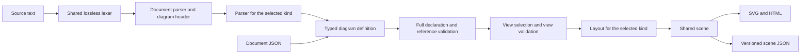

# Draft Layup language design

The [vocabulary review](LANGUAGE-VOCABULARY.md) supersedes the spellings,
compatibility policy, and extension rules in this draft. It defines replacing
the legacy source
grammar outright, using `type` for diagram grammar, `style` for presentation,
`palette` for coordinated colors, and explicit paint properties. The draft
below remains the behavioral design and snapshot of the first implementation;
its examples have not yet been converted to the reviewed vocabulary.

Layup has a shared source language and a typed grammar for each diagram kind.
The shared language defines comments, values, declarations, references,
annotations, and scope boundaries. Diagram grammars define the objects,
relationships, content, and ordered events that make sense in that diagram.

This is the proposed next language revision. The shared document/graph checkpoint is
implemented in the current checkout: see the
[experimental guide](site/guide/language-v1.md) and
[canonical fixture](../examples/language-v1.layup). It covers the optional-revision document shell, exact choice/integer/float values,
open annotations, opaque unavailable bodies, sibling recovery, scoped graph
objects and multi-diagram selection. Views/defaults, the other diagram
grammars, ports, and the proposed document JSON input remain planned. The
[current language reference](DESIGN.md) and [public DSL reference](site/reference/dsl.md)
continue to describe unversioned syntax. Examples here use `text` fences because
the document describes the complete target design, beyond the implemented subset.

## Design decisions

| Question | Decision |
| --- | --- |
| Language boundary | One shared lexer and document grammar; a parser and validator per diagram kind |
| Diagram declaration | `diagram ID ["Label"] kind=KIND { ... }`; kind is required |
| Identity | Named semantic objects require IDs; labels never generate referencable IDs |
| Names | Bare Unicode identifiers or quoted names; a dot qualifies a reference |
| Scopes | Diagrams and named semantic containers introduce scopes; layout/event blocks do not |
| Styling | Named attributes; no color/font/fill words interpreted as IDs or flags |
| Annotations | Typed metadata attached to one following construct; explicit opaque metadata extension |
| Validation | Validate the complete definition before selecting and laying out a view |
| Intermediate model | Typed diagram variants; DSL and document JSON construct the same definitions |
| Compatibility | Replace the legacy source grammar; an optional revision header asserts the supported version |

## Shared document syntax

A replacement-language file contains one or more named diagrams. An optional
`layup 1` header asserts a source-language revision, independent of package and
scene versions. Once migration is complete, an absent header also uses the new
grammar. Unknown revisions are errors; there is no legacy fallback. The current checkpoint accepts named diagrams with or without the assertion.
Title-only legacy sources retain existing diagram features during migration.

```text
layup 1

diagram system "Job processing" kind=graph {
  node client "Client"
  node api "API" tone=blue
  client -> api "Submit job"
}

diagram request "Submit a job" kind=sequence {
  participant client "Client"
  participant api "API"
  client -> api "POST /jobs"
}
```

Diagram IDs are unique within the document. Diagram kinds are `graph`,
`state-machine`, `sequence`, and eventually `er`. ER syntax below is the next
extension target, not part of the first parser implementation. The kind is fixed
for the definition and its views. `model` is no longer a separate wrapper:
a diagram owns its definition and may contain named views.

Labels are optional and default to the declaration's local ID. Explicit empty
labels are permitted for ordinary objects; diagrams require a nonempty display
label. Marker-only objects such as `initial` and `final` reject labels. IDs and
quoted name segments must be nonempty and cannot contain control characters.

### Comments and statement boundaries

`//` starts a line comment outside a string, including after code on the same
line. `/* ... */` is an inline or multiline block comment; block comments can
nest up to 128 levels. Comments remain available to formatters and migration
tools, without annotation semantics. Strings can contain comment-like text
literally. An unterminated block comment is an error at its opening delimiter.

Comments act as whitespace and do not join identifier fragments. Newlines
inside block comments do not terminate a statement; the newline after a line
comment does. Comment delimiters inside a block comment still participate in
nesting; quotes there are ordinary comment text. Formatting preserves block
comment contents, including their internal whitespace and newlines.

A newline or semicolon separates statements. Braces delimit blocks; the closing
brace also terminates its final statement. Newlines inside a string belong to
that string. Newlines inside lists, record values, and annotation parentheses
are whitespace. A block opener belongs to its declaration's statement.
Explicit line continuation and executable expressions are not supported.

The formatter uses two-space indentation, newlines instead of semicolons, and
preserves comments, string contents, and the authored order of declarations and
events. A future migration command changes syntax; ordinary formatting does not
switch the language revision.

### Identifiers and references

A bare identifier starts with a Unicode identifier-start character or `_`.
Continuation characters are Unicode identifier-continue characters and single
hyphens between valid identifier characters. `::`, `.`, `/`, and whitespace
are not part of a bare identifier. `a-b` is a name; compact `a->b`, `a<-b`,
`a<->b`, and `a--b` are connections. `true`, `false`, and `null` require quoting
when used as names. Other grammar keywords are contextual, not globally banned
as object IDs. For example, `node red` declares ID `red`.

Names preserve their exact Unicode spelling; there is no case folding or
normalization. Existing combining-mark identifier behavior remains supported.
User-visible labels are independently shaped and wrapped.

Quoted strings are names when the grammar expects an ID or reference segment:

```text
node "API::run(&self)" "Run"
node "src/api.rs" "API source"
"API::run(&self)" -> "src/api.rs"
```

In a named declaration, the first name is always the ID and the following
optional string is the label. Consequently `node "Worker"` declares the literal
ID `Worker` with its default label; it does not generate a slug. Decorative text,
dividers, and gaps do not need IDs. Anonymous connections/messages are permitted,
but cannot be referenced by views or presentation steps.

A reference is a sequence of name segments separated by dots. A leading `::`
anchors it to the current diagram root:

```text
backend.worker
backend."worker.v2"
::backend.worker
"backend.worker"
```

The final example is one literal segment, different from the first example's
two segments. IDs and references use the same spelling rules in connections,
includes, hints, transitions, annotations that accept references, and steps.
There are no connections across diagram boundaries in this revision.

### Values and attributes

Attributes have the form `key=value`; their order never changes meaning.
Keys use the existing lowercase/hyphen convention, such as `text-direction`.
Allowed keys and value types are validated for the specific construct.

Values are strings, finite numbers, booleans, null, bare enum words, lists, or
records. Enum words are string values, not references or variable expressions.
A reference-valued attribute is interpreted by its declared schema; an enum
such as `tone=blue` never looks up an object named `blue`.

```text
tone=blue
fill=hollow
font=mono
weights=[1, 2, 1]
enabled=true
range={startLine: 4, startColumn: 1, endLine: 8, endColumn: 2}
```

Lists and records are comma-separated, permit a trailing comma, and may span
lines. Record keys are identifiers or strings. Duplicate keys and attributes
are errors. Strings retain the current `\"`, `\\`, `\n`, `\t`, and `\r` escapes
and literal multiline contents. A later Unicode escape addition must reject
surrogate and out-of-range values; it is not required for this revision.
Unknown escapes remain errors. Decimal integers preserve signed/unsigned 64-bit values exactly; decimal-point
and exponent literals are finite floats. Tagged JSON represents integers as
decimal strings for JavaScript consumers. Geometry adds its own positivity and bound constraints.

No construct accepts two ways of assigning the same property in one declaration.
For example, a positional label plus `label=` is an error. The initial revision
uses positional labels and removes `name`/`title` body aliases. Text content uses
`text "..."`; `code "..."` is literal code text. Neither accepts a body.

### Grammar skeleton

This EBNF describes shared helpers, not the contents of every diagram block.
The diagram parser supplies `statement` and its allowed attributes. `separator`
is a newline or semicolon; a final statement may end immediately before `}`.

```ebnf
document       = { separator }, [ version, separator, { separator } ], diagram,
                 { separator, { separator }, diagram }, { separator } ;
version        = "layup", integer ;
diagram        = { annotation }, "diagram", name, [ string ],
                 { attribute }, block ;
name           = identifier | string ;
reference      = [ "::" ], name, { ".", name } ;
attribute      = identifier, "=", value ;
registry-name  = identifier, { ".", identifier } ;
annotation     = "@", registry-name, "(",
                 [ attribute, { ",", attribute }, [ "," ] ], ")" ;
value          = string | number | "true" | "false" | "null"
               | identifier | list | record ;
list           = "[", [ value, { ",", value }, [ "," ] ], "]" ;
record         = "{", [ pair, { ",", pair }, [ "," ] ], "}" ;
pair           = name, ":", value ;
block          = "{", { separator },
                 [ statement, { separator, { separator }, statement } ],
                 { separator }, "}" ;
```

Diagram headers require exactly one `type` attribute even though the skeleton
accepts an attribute list. Reference-valued attributes use the `reference`
helper instead of `value`, as specified by their construct's schema. References
in lists use the same helper for each element when the list's schema requires
references. Opaque data records never resolve words as references.
Annotations allow whitespace/newlines between themselves and their target.
This whitespace is part of attachment, not a separate standalone statement.

## Annotations

An annotation has the form `@name(key=value, ...)`, including namespaced names
such as `@acme.owner(...)`, and attaches to the next complete construct in the
same block. Registered schemas restrict eligible targets. Several annotations
may precede a
construct. Their argument syntax and source positions are shared across kinds.
No annotation attaches through a closing brace or automatically propagates to
descendants. An annotation without a following eligible target is an error.

```text
@source(uri="src/jobs.rs", symbol="submit")
@doc(text="Entry point for accepting a job")
node submit "Submit job"

@source(uri="src/jobs.rs", range={
  startLine: 12, startColumn: 3,
  endLine: 12, endColumn: 24,
})
edge dispatch submit -> worker "Dispatch" kind=calls
```

The shared annotation registry initially contains:

| Annotation | Meaning and cardinality |
| --- | --- |
| `@source(uri=..., symbol=..., range=...)` | Original-code location; repeatable on semantic objects and relationships/events; URI required, symbol/range optional |
| `@doc(text=...)` | Plain-text documentation; singleton on diagrams and named semantic declarations |
| `@meta(namespace=..., value={...})` | Opaque JSON-compatible metadata; one record per namespace on a target |

Source ranges use 1-based lines and Unicode scalar columns with an exclusive
end, matching the current structured-input convention. File-level locations
omit the range. A source annotation describes analyzed code; it does not replace
the DSL construct's own source span.

Invalid registered targets/arguments and repeated registered singleton
annotations are errors. Unknown annotations are preserved in order, including
their names, arguments, target associations, and spans. Unregistered names are
normally quiet; a strong spelling match to a registered name can produce a
warning without changing the annotation. Host-registered extension schemas add
typed behavior without changing the lexer; they cannot override core names.
`@meta` is a convenient extension container, rather than the only extension
mechanism. Ordinary comments remain trivia. See the
[extension annotation rules](LANGUAGE-VOCABULARY.md#extension-annotations).

## Name scopes and object identity

### Scope boundaries

| Construct | Object scope behavior |
| --- | --- |
| Diagram | Introduces an independent root object scope |
| Graph `group`, `package`, `crate`, or a node with children/ports | Introduces a child object/member scope |
| Composite `state` | Introduces a child state scope |
| ER entity or future class/interface | Introduces a member scope |
| `row`, `section`, `band`, and content compartments | Do not introduce a name scope |
| Sequence `loop`, `opt`, `alt`, and `branch` | Do not introduce a participant or message scope |
| View and presentation step | Do not declare or move model objects |

Containment introduces a scope only when the diagram grammar defines it as
semantic containment. Layout grouping never changes an object's identity.
Adding an authored row must not invalidate references to its cells.

In a relative reference, look up the first segment in the current scope, then
its ancestors. Resolve subsequent segments as children of that object. Do not
search unrelated descendants, and do not retry another ancestor after finding
a first segment whose child path fails. Root references start at the diagram
scope. Forward references are allowed; lexical position does not determine
whether a declared object exists.

Duplicate object names within a scope are errors. Reusing an ancestor's object
name in a descendant scope is rejected initially, avoiding implicit shadowing.
The same local name in sibling containers is allowed:

```text
group frontend "Frontend" { node cache "Cache" }
group backend "Backend" { node cache "Cache" }
frontend.cache -> backend.cache "Synchronize"
```

### Identity categories

Object IDs form the hierarchical object namespace. Named connections/messages
have a separate diagram-wide namespace, even when authored inside a container
or sequence fragment. Views, steps, node kinds, and edge kinds each have their
own namespace. Context selects the category: `show` refers to objects;
`show-edge` refers to named connections/messages. A view's step IDs are unique
within that view's effective presentation plan.

The typed identity of an object is `(diagram ID, path segments)`, not a string
made by joining segments with dots. Endpoints contain an object identity plus
an optional member/port identity. A field and an entity are distinguishable
even though they share qualified-reference syntax. Diagram validators determine
which endpoint types a relationship accepts.

Moving an object into a semantic container changes its qualified identity;
moving it into a row does not. Rendered IDs are stable opaque encodings of typed
identity. Export the path segments separately so consumers never parse those
encodings. Anonymous events receive internal render keys but have no public
source identity that can be referenced or promised stable across edits.

## Shared presentation rules

Named attributes replace bare style flags: `tone=blue`, `fill=hollow|filled`,
`font=mono|sans`, `align=start|left|right|center`, and `stroke=dashed|solid`.
Each diagram kind declares which constructs accept them. `text-direction` is
independent of graph flow, defaults to `auto`, and inherits through semantic
containers. Labels and code retain current Unicode/RTL/CJK behavior; CJK fonts
remain supplied or system fonts. Light/dark/auto theme remains a render option.

Graph/custom presentation kinds are explicit declarations, not new statement
keywords:

```text
defaults node tone=gray
node-kind service base=node shape=card tone=blue
edge-kind calls tone=blue stroke=solid label="calls"

node api "API" kind=service
edge dispatch api -> worker "Dispatch" kind=calls
```

Built-in defaults are resolved first, then explicit `defaults` per category,
then bases and declared-kind overrides, then instance attributes. A category
may have one `defaults` declaration per diagram. A kind may have one declaration;
redeclaring a built-in or custom kind is an error. `base=` resolves before all
overrides, regardless of attribute order. Forward bases are valid; cycles and
unknown bases fail. Custom kind declarations are diagram-local and cannot add
lexer keywords or override diagram semantics. Future view style overrides need
an explicit mechanism; they are not implicit repeated declarations.

Diagram/view-level layout uses named options. Keep `preset=clean|manual` for
style policy and `layout=auto|manual` for graph placement; neither changes the
diagram grammar. Keep width and slide-fit behavior separate. Legend configuration
uses `legend enabled=false` or named placement/kind-list attributes rather than
bare flags. Every accepted option must have an effect or be rejected.

| Option | Default and validity |
| --- | --- |
| Graph `layout` | `manual`; `auto` opts into inferred ranks |
| Machine `layout` | `auto`; `manual` permits authored layout with machine validation retained |
| Graph/machine `direction` | `down`; graph non-default directions require automatic layout |
| Sequence `direction` | `right`; only `right`/`left`; `layout` is rejected because chronology defines placement |
| `text-direction` | `auto` independently of graph/participant direction |
| `preset` | `clean`; `manual` selects explicit-only style policy, not a different parser |
| Width and slide fitting | Retain current automatic/pinned-width and separate viewport-transform behavior |

`subtitle "..."` is common diagram subtitle content. Diagram-level
`@doc(text="...")` supplies the accessible description; absent documentation
uses the renderer's generated description. Explicit diagram documentation is
metadata, not an additional prose/layout block. Source `desc` migrates to it.

## Diagram grammars

### Graph

Graph objects include `node`, `group`, `package`, `crate`, `api`, `trait`,
`type`, `module`, `process`, `decision`, and `terminal`. The existing shapes
remain available; new semantic categories are not implied by a custom shape.
All declarations use `KEYWORD ID [LABEL] [ATTRIBUTES] [BODY]`.

```text
layup 1
diagram jobs "Job processing" kind=graph layout=auto direction=right {
  node-kind service base=node tone=blue
  edge-kind publishes tone=purple label="publishes"
  node client "Client"
  group backend "Backend" {
    node api "Job API" kind=service {
      code "POST /jobs"
      text "Validate and accept the request"
    }
    node queue "Queue" tone=purple
    node worker "Worker" tone=green
    edge enqueue api -> queue "Enqueue" kind=publishes
    edge consume queue -> worker "Consume"
  }
  edge request client -> backend.api "Submit"
}
```

`edge ID SOURCE ARROW TARGET [LABEL] [ATTRIBUTES]` names a relationship.
`SOURCE ARROW TARGET [LABEL] [ATTRIBUTES]` creates an anonymous relationship.
Arrows are `->`, `<-`, `<->`, and `--`. `kind=uses|impl|...` replaces typed
arrow lexemes such as `-uses->`; `label` is positional, and `caption=kind`
requests a kind's default caption. Stroke, tone, and bus sharing are attributes.
Graph statements are declaration-order independent for name resolution but
retain authored order for manual layout and automatic-layout tie breaking.

Graph content accepts `code`, `text`, and explicit `tag` text. Leading `[tag]`
in a label becomes literal text, removing hidden tag interpretation. Graph
semantic child blocks create object scopes. Compact shapes still reject child
diagrams; surrounding containers provide the boundary.

Authored layout retains rows, bands, sections, dividers, and gaps. For example,
`row weights=[1, 2] gutter=24 { ... }` replaces colon weights. These blocks do
not change reference scope. Placement hints use reference-valued attributes
`after=api`, `same-layer=api`, and `beside=api`. `after` replaces the
direction-specific `below` alias.

Routing options become `source-side`, `target-side`, and `via`. Source/target
follow semantic arrow direction: `a <- b` has source `b`, target `a`; `<->`
and `--` retain the written source/target order. Options never swap based on
whether another option happens to be present. Named ports are reserved as
object members with `port ID side=SIDE`; they do not introduce a new separator.
A port and a child object cannot share a local name in the same scope.

```text
node api "API" { port output side=right }
node queue "Queue" { port input side=left }
edge enqueue api.output -> queue.input "Enqueue"
```

Member/port endpoints identify exact anchors; `source-side`/`target-side` apply
only to whole-object endpoints. Supplying a side override as well as a named
member/port endpoint is an error, rather than silently moving its anchor.

### Sequence

Sequences declare `participant` and `actor` objects and an ordered event tree.
Participants have explicit IDs and optional labels/attributes, without bodies.
`direction=right|left` determines participant order; time always moves downward.
Graph layout hints, outside routing, and automatic graph ranks are invalid.

```text
layup 1
diagram submit "Submit a job" kind=sequence {
  actor user "User"
  participant api "API"
  participant worker "Worker"
  message request user -> api "POST /jobs"
  message dispatch api -> worker "Queue work" delivery=async
  api -> user "202 Accepted" delivery=return
  note "Validate the payload" over=api
  loop "Until complete" {
    user -> api "GET /jobs/:id"
    alt "Job status" {
      branch "Complete" { api -> user "200 + result" delivery=return }
      branch "Pending" { api -> user "200 + pending" delivery=return }
    }
  }
}
```

`message ID ...` names a message; a bare connection is an anonymous message.
`delivery=sync|async|return` replaces bare `async`/`return` words and controls
the existing visual conventions, not execution. Messages accept only directed
`->`/`<-` arrows. Notes, loops, options, alternatives, and branches remain ordered
events. Fragments do not scope participant names; message IDs remain unique
across the diagram. Branch labels do not become names. Fragment conditions and
message labels remain display text with no evaluation or simulated behavior.
Activation, participant lifetimes, and parallel fragments are later grammar
extensions, not generic graph flags.

### State machine

State machines declare `state`, `initial`, `final`, and `choice` objects.
Composite states introduce scopes. `transition ID ...` names a transition;
a bare directed connection is an anonymous transition. Keep scoped initial
validation, final/choice rules, reachability diagnostics, and cycle placement.

```text
layup 1
diagram connection "Connection lifecycle" kind=state-machine direction=right {
  initial start
  state offline "Offline"
  state connected "Connected" {
    initial enter
    state ready "Ready"
    state sending "Sending"
    enter -> ready
    transition send ready -> sending event="send"
    sending -> ready event="ack"
  }
  start -> offline
  offline -> connected event="connect"
  connected -> offline event="disconnect"
}
```

State members may reuse names in siblings but may not shadow ancestors.
Declaring another `initial start` inside `connected` would fail with a related
location pointing to the diagram-root `start`; the example uses `enter` instead.

Transitions accept `event`, `guard`, and `action` as opaque string properties,
rendered using the existing `event [guard] / action` convention. A separate
positional label cannot coexist with these structured properties. They are not
executable expressions. State `entry`/`exit` code-text directives can be added as
typed content without inferring behavior from ordinary prose. Machine mode is
fixed by the header, independent of a node's shape or custom kind.

### Entity relationships and member content

ER is the first new grammar to exercise scoped members and structured content.
An entity owns a member scope. A `fields` compartment groups content visually
but does not introduce an extra name segment. Fields require IDs and accept
an optional label, display type, nullability, and key role.

Initial field attributes are `type=STRING`, `nullable=true|false` (default
`false`), and `key=none|primary|foreign|unique` (default `none`). `type` has no
implicit default and is optional display text. Combined/composite keys need a
later explicit schema rather than overloading one key-role enum.

```text
layup 1
diagram schema "Orders" kind=er {
  entity orders "Orders" {
    fields {
      field id type="uuid" key=primary
      field customer_id type="uuid"
      field total type="decimal"
    }
  }
  entity customers "Customers" {
    fields {
      field id type="uuid" key=primary
      field name type="text"
    }
  }
  relationship customer_fk orders.customer_id -> customers.id from-cardinality=many to-cardinality=one
}
```

Cardinality values are `one`, `zero-or-one`, `many`, and `one-or-many`, lowered
to minimum/maximum pairs. `many` means zero-or-more, not one-or-more. The
diagram validator resolves entity/member endpoints and rejects missing members.
Cardinality, key annotations, and endpoint attachment need an explicit rendering
contract before ER ships; field `type` is display text, not a database type checker.

Content becomes a typed list: text, code, tags, compartments, members, and ports.
Class/interface methods can later reuse this content model while retaining their
own grammar and validation. Content members remain different from child diagrams
and layout rows; a member connection targets its own measured anchor.

## Views and presentations

A diagram may define `view ID [LABEL] { ... }`. Every view selects the same
typed definition and kind; it cannot add declarations or alter endpoints.
No views means render the full definition; otherwise the first authored view
is the default. Multiple diagrams require `--diagram ID`; selecting a view is
then local to that diagram. A single-diagram file needs no diagram selector.

```text
view overview "System overview" {
  include client backend
}
view detail "Worker detail" direction=down {
  include backend.queue backend.worker
  step consume "Consume queued work" {
    show backend.queue backend.worker
    show-edge consume
    highlight backend.worker
    speaker-note "The worker consumes the queued job."
  }
}
```

Includes use diagram-root scope, preserve necessary ancestor frames, and expand
included containers as today. Members cannot be independently included in the
initial ER view grammar; include their owning entity. Edges survive when both
semantic endpoints survive. Rows preserve selected cell order and weights.
Sequence filtering preserves event order and valid nonempty fragments/branches.
Machine views still need valid initial scopes.

Steps are an ordered presentation plan, separate from graph or sequence events.
Keep `show`, `show-edge`, `highlight`, and `highlight-edge`; use `speaker-note`
instead of overloading `note`. If a view declares steps, they replace the shared
plan. Shared plans must validate against the selected result. Step targets use
typed identity categories, not a heuristic lookup across node and edge IDs.
The initial step grammar targets whole rendered objects and relationships or
messages; independently showing a field/port is rejected until member reveal
has a defined rendering contract.
View layout overrides are whitelisted per kind; they cannot change semantic
membership except through includes. Aggregation and query expressions are deferred.

## Parser and semantic architecture



Reuse parser utilities for names, references, labels, attributes, annotations,
values, blocks, and recovery. Do not encode every specialized construct in a
catch-all `Item { head, args, body }` and reinterpret it repeatedly. Source
syntax retains spans and trivia; the semantic model retains source origins
without requiring fabricated source text for JSON input.

The typed document has named diagrams with common options/metadata, views, and
presentation plans. Its body is a tagged variant:

| Variant | Typed contents |
| --- | --- |
| Graph | Object declarations, relationships, hierarchy, content, authored layout |
| Sequence | Participant declarations and an ordered event tree with messages/notes/fragments |
| State machine | State scopes and transitions with opaque event/guard/action strings |
| ER | Entity/member declarations and typed relationships/cardinality |
| Opaque | Common envelope plus an uninterpreted source/JSON body for an unavailable type |

The intended Rust structure is a design sketch, not a public API declaration:

```rust
struct Document {
    revision: u32,
    diagrams: Vec<DiagramDefinition>,
}

struct DiagramDefinition {
    id: Name,
    label: Option<String>,
    annotations: Vec<Annotation>,
    body: DiagramBody,
    views: Vec<ViewDefinition>,
    presentation: PresentationDefinition,
    origin: Option<Origin>,
}

enum DiagramBody {
    Graph(GraphDefinition),
    Sequence(SequenceDefinition),
    StateMachine(MachineDefinition),
    EntityRelationship(EntityDefinition),
    Opaque(OpaqueDefinition),
}

struct Endpoint {
    object: ObjectId,       // Diagram identity and object path segments.
    member: Option<MemberId>,
}
```

Relationship identity, endpoint direction, style, and source evidence can share
types. Sequence events carry chronology explicitly in their event tree; they
are not reconstructed from an unordered relationship collection. A source parser
can keep a concrete syntax tree for trivia plus typed definitions for semantics;
JSON goes straight through typed-definition validation.

Unrecognized diagram types preserve their envelopes and opaque bodies, skip
compilation with a warning by default, and offer conservative spelling hints.
Explicitly selecting an unavailable diagram is an error. Raw balanced-block
scanning must happen before body lexing so extension punctuation does not break
supported siblings. Known malformed bodies remain errors. See the
[selection, diagnostics, and preservation policy](LANGUAGE-VOCABULARY.md#unrecognized-diagram-types).

Use shared `Name`, `Reference`, `ObjectId`, `Endpoint`, `Annotation`, `Origin`,
`Content`, and presentation option types. Distinguish source-order information
from relationship identity and from chronology. Every registry declaration is
collected before inheritance resolution; every semantic object/reference is
validated before any view excludes it. Geometry and view-dependent machine or
sequence checks run after selection. Independent semantic errors should be
collected, while dependents of a missing/invalid declaration avoid cascades.

Recovery stops at statement/block boundaries and retains valid siblings. Keep
the existing 128-level source nesting limit; add equivalent limits for value
nesting and annotation payloads. Formatters must preserve list/record structure,
multiline strings, comments, and event order without semantic resolution.
Opaque blocks retain their interior byte-for-byte, including future grammar
punctuation. Parsing and formatting do not require an available renderer.

## JSON and output contracts

Document JSON uses an explicit discriminator, for example
`{"schema":"layup/document","version":1,"diagrams":[...]}`. It constructs the
same typed definitions as source; no JSON mode invents custom kinds or ignores
mode-specific rules. References/identities use arrays of name segments and an
explicit member target, not strings that a consumer must split on punctuation.

The structural shape is illustrated below; optional field names and enum
serialization still require the schema checkpoint before they become an API:

```json
{
  "schema": "layup/document",
  "version": 1,
  "diagrams": [{
    "id": "jobs",
    "label": "Job processing",
    "body": {
      "kind": "graph",
      "objects": [
        { "id": ["api"], "type": "node", "label": "API" },
        { "id": ["worker"], "type": "node", "label": "Worker" }
      ],
      "relationships": [{
        "id": "dispatch",
        "source": { "object": ["api"], "member": null },
        "target": { "object": ["worker"], "member": null },
        "direction": "forward",
        "kind": "flow",
        "label": "Dispatch"
      }],
      "layout": { "mode": "auto", "direction": "right" }
    },
    "views": []
  }]
}
```

For an ER field endpoint, use an object path such as `["orders"]` and a member
path such as `["customer_id"]`. Source `orders.customer_id` is resolved into
those separate fields; the renderer does not infer which segment is a member.

The existing graph-input version 1 remains a separately identified convenience
contract during migration. An adapter must map its opaque IDs and flat endpoint
references to typed identities deliberately, preserving its observable IDs and
provenance. If preserving that contract would conceal incompatible meaning,
provide an explicit conversion and a versioned replacement instead of silently
reinterpreting the input.

Semantic document JSON and drawing scene JSON remain distinct. Source locations
include file URI plus optional span/range; analyzed-code locations remain
separate. DSL/JSON parity includes default options, validation, identity,
hierarchy, event order, text direction, views, and presentation plans.
Scene version 1 must not silently change ID or source-span semantics. Introduce
a new scene contract for qualified identity fields or incompatible changes,
while preserving old output through a documented compatibility path if needed.
Renderers retain light/dark/auto themes and the existing supplied-font policy.

## Migration and implementation order

| Current source | New spelling or behavior |
| --- | --- |
| `diagram "Title" ...` | `layup 1` plus `diagram main "Title" kind=graph ...` |
| `model "Title" ...` | Named diagram containing the same views |
| `mode=sequence` / `mode=state-machine` | `kind=sequence` / `kind=state-machine` |
| `node api "API" blue hollow mono` | `node api "API" tone=blue fill=hollow font=mono` |
| `node "API"` | Resolve the legacy generated ID, then write it explicitly with the original label |
| `node id="opaque" "Label"` | `node "opaque" "Label"` |
| `service api "API"` | `node api "API" kind=service` with an explicit `node-kind` declaration |
| `a -uses-> b id=request` | `edge request a -> b kind=uses` |
| `row 1:2` | `row weights=[1, 2]` |
| `sub "..."` / node prose `text "..."` | `text "..."` |
| Node body `name` / `title` / `role` / `tag` | One positional label or an explicit `role` attribute / `tag` content item; reject conflicting assignments |
| Label prefix `[tag] ...` | Explicit `tag "..."` content plus the remaining label |
| Graph subtitle `note "..."` | `subtitle "..."` |
| Diagram `desc "..."` | Diagram-level `@doc(text="...")` |
| Step `note "..."` | `speaker-note "..."` |
| Bare sequence `async` / `return` | `delivery=async` / `delivery=return` |
| Global child IDs inside containers | Qualified references, preserving the same intended endpoints |
| Silent duplicate labels, ignored bodies, or overwritten declarations | Errors with primary and related source spans |

A migration tool must resolve the legacy document before rewriting references,
styles, generated IDs, and custom kinds. It must account for scope introduction
and style-order semantics instead of mechanically replacing tokens. Generated
edge IDs used by legacy steps become explicit names. Unsupported/ambiguous
conversion fails without rewriting files. Existing string escaping, Unicode,
comments, and authored order must survive. Imports, templates, and executable
expressions are outside this revision.

Implementation checkpoints:

1. Shared tokens/values/references/annotations and versioned document parser.
   Lock valid and invalid grammar examples, quoted-name disambiguation, and recovery.
2. Graph and sequence typed definitions. Prove current features can migrate,
   with scopes distinct from rows/fragments and stable qualified endpoints.
3. Full model validation, style inheritance, selectors, and typed views/steps.
   Add JSON parity through the same definitions before expanding the input API.
4. Composite state migration and source-origin/export contract decisions.
5. Member/port geometry and ER syntax/cardinality as the first new grammar.
6. Migrate canonical examples and public guides; validate CLI/WASM, formatting,
   Unicode/RTL/CJK, rendering, presentation, and scene consumers together.

Required acceptance fixtures include a node named `red`, opaque quoted symbol
IDs, literal dots versus qualified paths, sibling `cache` objects, prohibited
shadowing, row insertion without identity change, fragment insertion without
message renaming, order-independent style attributes, forward/cyclic bases,
multiple source annotations, invalid annotation targets, reverse/bidirectional
ports, hidden invalid declarations, and missing member endpoints.

Existing canonical examples supply the migration coverage:

| Examples | Behavior that must survive |
| --- | --- |
| [Hello](../examples/hello.layup), [service layers](../examples/service-layers.layup), [storage contracts](../examples/storage-contracts.layup) | Node content, kinds, tags, roles, weighted rows, hierarchy, typed relationships, legends and explicit routes |
| [Automatic layout](../examples/auto-layout.layup), [directions](../examples/directions.layup), layout checkpoints | Automatic ranks, authored boundaries, hints, disconnected components and stable tie breaking |
| [Decision tree](../examples/decision-tree.layup), [decision flow](../examples/decision-flow.layup) | Branching, merges, captions, compact outlines and all-direction geometry |
| [State machine](../examples/state-machine.layup), [composite state](../examples/state-composite.layup), [choice](../examples/state-choice.layup) | Scoped initial paths, transitions, composite entry, reachability and cycle routing |
| [Sequence](../examples/sequence.layup), [request presentation](../examples/presentation-model.layup) | Message identity/order, self calls, return/async styles, fragments and view-local reveal plans |
| [Model views](../examples/model-views.layup), [slides](../examples/slides.layup) | Subtree includes, ancestors, cell weights, direction overrides, slide fitting and readability checks |
| [International text](../examples/international.layup), [RTL](../examples/right-to-left.layup), international decision/state/sequence examples | Exact Unicode names/text, scalar spans, graph/text direction separation, CJK wrapping and supplied-font behavior |
| [Cargo structured input](../examples/code-analysis.json) | Opaque IDs, parent hierarchy, selected evidence, provenance and native/WASM parity through a deliberate adapter |

The remaining extension decisions are ER glyph/key conventions, the exact new
document/scene JSON schemas, and limits on opaque metadata size. They do not
change the shared syntax and scope rules above and must be resolved before
their implementation checkpoints ship.
